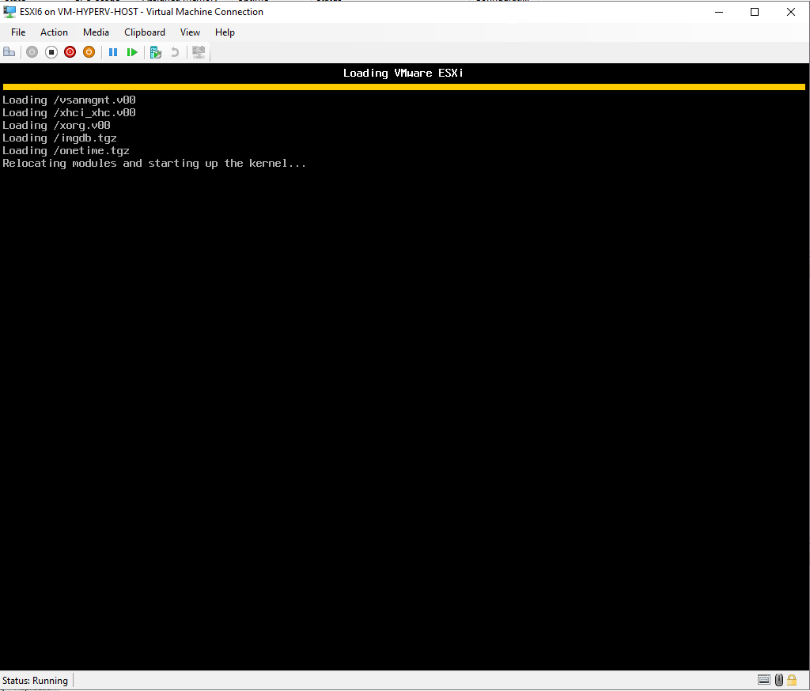
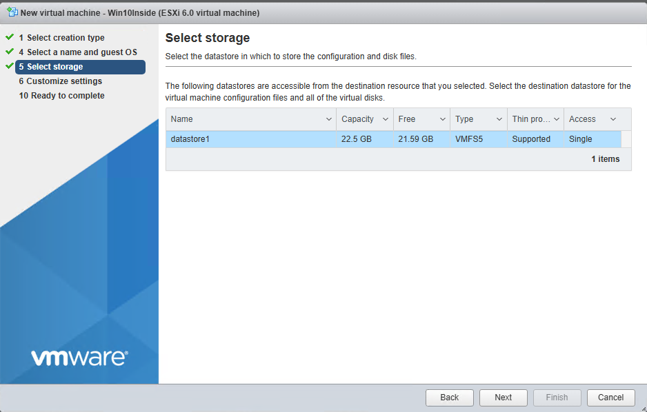

# ESXi Deployment on Azure VM (Nested Virtualization)

🔧 Requirements for Nested Virtualization in Azure
- **VM Size**: Only certain VM sizes support nested virtualization, such as: D_v3, E_v3, F2s_v2, M, and newer series
- **OS**: The host VM must run a supported OS like Windows Server or Windows 10/11 Pro/Enterprise.
- **Hypervisor**: Hyper-V must be enabled inside the VM.

## Step 1: Create Azure VM with Nested Virtualization


Note: All other settings remain at their default values. Make sure to enable RDP in NSG and use public IP Standard SKU. 

## Step 2 : Connect to VM
### 1st Method
1. Go to Azure portal -> Virtual Machines -> choose the VM that you created -> copy the Public IP Address 
2. Go to Remote Desktop on your PC in Start Menu -> paste the Public IP Address -> Click on **Connect** -> fill the username and password (Credentials) -> Click on **OK**
   


3. Click on **Yes**
   


### 2nd Method
1. Inside the Virtual Machine in Azure Portal Click on button **Connect**
   


2. Click on **Download RDP file**
   


3. Click on **Keep** to download the file
   


4. Open the file and click on **Connect**
   


5. Fill your credentials and then click on **OK**
    


6. Click on **Yes**
   


## Step 3: Install Hyper-V
Right click on the Window Logo -> Click on **Windows PowerShell (Admin)**


```powershell
Install-WindowsFeature -Name Hyper-V -IncludeManagementTools -Restart
```
The command will install Hyper-V Feature with Hyper-V Manager and then restart the Server

## Step 4: Creating Hyper-V NAT Network
The objective is to connect a network interface to ESXi, enabling it to access external networks by routing traffic through the public IP address assigned to the Azure virtual machine.
To do the steps below, open Cmd in admin and copy the commands. 

1. **Creating VSwitch is a virtual network in Hyper-V named NAT-Switch with a type internal.**

```powershell
New-VMSwitch -Name "NAT-Switch" -SwitchType Internal
```


2. **Find the Interface Index of the New VSwitch**

```powershell
Get-NetAdapter | Where-Object { $_.InterfaceDescription -like "Hyper-V*" }
```
 

3. **Assign an IP Address to the VSwitch**
You can use a subnet mask of your choice and IP address RFC 1918. The value of ifIndex is one gathered in the step 2 

```powershell
New-NetIPAddress -IPAddress 192.168.100.1 -PrefixLength 24 -InterfaceIndex <ifIndex>
```
 

or you can use this command and bypass step 2

```powershell
New-NetIPAddress -IPAddress 192.168.100.1 -PrefixLength 24 -InterfaceAlias "vEthernet (NAT-Switch)"
```
 

**The steps above is like you have a network card and you put a static IP inside the TCP/IPv4 network settings.**
 

4. **Create Network Natting**
The 192.168.100.0/24 network will be NATed through the public IP address of the Azure virtual machine. For example, a VM with a private IP of 192.168.100.2 will have its outbound traffic translated to the VM’s public IP.
   
```powershell
New-NetNat -Name "NATNetwork" -InternalIPInterfaceAddressPrefix 192.168.100.0/24
```
 


## Step 5: Creating ESXI VM on the Hyper-V
**Prerequisite:** Download Custom ESXi ISO image from resources. In this Image you have the net-tulip driver that works with hyper-V. The Image is done with ESXI Customizer tool by Alex Lopez. 
1. Open Hyper-V manager, click Action > New > Virtual Machine.
 

 

2. Specify a name for the virtual machine (e.g., ESXi6) and choose a storage location based on your preferences—ideally on a disk that doesn’t contain an operating system. Click **Next**
   
 

3. Select Generation 1 for your VM in order to make it possible to use a legacy network adapter with the compatible drivers that you have integrated into the ESXi installation image. Click **Next**
   


**PS: Even if you create Legacy network and use official ISO not custom version 6, you will get this message**


4. Assign at least 4 GB of memory. Using Dynamic Memory for this virtual machine is not recommended. Click **Next**
   


5. Configure the networking settings as desired—using the “None” option or any available configuration—since the VM’s network must be manually reconfigured after creation. Note that selecting a Legacy network adapter during VM setup isn't supported, so you’ll need to remove the default adapter afterward and create a Legacy one manually. Click **Next**


6. Create a new virtual disk, allocating 30 GB as a starting point. If you plan to run multiple VMware virtual machines on your ESXi host, consider assigning a larger size upfront, or add additional virtual disks later as needed. You may also opt for a dynamically expanding disk to optimize storage use. Verify the disk’s name and location, then proceed by clicking **Next**.


7. Select Install an operating system from a bootable CD/DVD-ROM in Installation Options. Use the ISO image file that you have prepared beforehand (ESXi-6.x-custom.iso in this example). Click **Next**.
   


8. Check the summary and click **Finish** to finalize the VM creation.
   


## Step 6: Setting up ESXi VM on Hyper-V
1. Once a new Hyper-V virtual machine is created, edit the VM settings. Right-click the name of your VM and select **Settings** in the context menu.
   


2. In the left pane of the window in the Hardware section, select Processor and set the number of virtual processors to 4 or more (1 processor is used by default). Otherwise, you will get errors during booting up phase. 


3. Select the network adapter. First, remove the existing network adapter created by default. In order to do this, click the **Remove** button.
   


4. Add a legacy network adapter to the VM. In the left pane of the window in the Hardware section click Add Hardware. In the right pane select Legacy Network Adapter and click **Add**.


Choose the name of the VSwitch created in step 5. In my case is NAT-Switch


## Step 7 : Enable Nested Virtualization
On Azure VM created, you have inside it ESXi VM or another OS + Hyper-V (level 3 - Architecture Diagram), pick up the name of the VM and use the command below on the host (level 2 - Architecture Diagram) 
```powershell
Set-VMProcessor -VMName "<vm-name>" -ExposeVirtualizationExtensions $true
```

## Step 8 : Install and Configure ESXi on the Hyper-V
1. When booting ESXi on a virtual machine, it may incorrectly detect the environment as headless—lacking a local console or video output. To bypass this and proceed with installation, you must manually add a boot parameter. Once the ESXi installer begins to load, press **TAB** at the boot prompt.
This will allow you to modify the boot options. Append the following parameter to the boot command line: ignoreHeadless=true.

**PS:Also using TAB is different than using SHIFT+o. Because while using shitft+o it don't detect the disk and the ESXi will run as live image.**


### Why TAB Detects IDE Disk but Shift+O Doesn't
This behavior likely stems from how the boot parameters are parsed and what drivers
are loaded depending on the boot method:
 ##### TAB Boot (Legacy Bootloader Behavior)
. In some custom ISOs, pressing TAB allows you to edit the boot command line directly
in a legacy isolinux/syslinux environment.
. This method may implicitly load legacy drivers, including VMKLinux-based IDE
drivers, which are deprecated but still present in some custom builds.
. If your ISO includes legacy support, TAB might trigger detection of older IDE disks.
 ##### Shift+O Boot (Modern Boot Option)
. Shift+O is used to append kernel parameters in the newer ESXi bootloader.
. If your custom ISO is built on a newer ESXi version (e.g., 7.x or 8.x), it may default to
native drivers only, excluding legacy VMKLinux drivers.
. This can result in IDE disks not being detected,
included or loaded.


**Info: If ignoreHeadless=TRUE is not set during the boot up, you will get stuck to the screen below**




2. When the installer has been loaded, you will see a welcome screen. Press **Enter** to continue.
   


3. Press **F11** to accept the license agreement and continue.
   


4. Select a disk to install ESXi on. There is a 30GB disk attached to the VM in our case. Press **Enter** to continue.


5. Choose the Keyboard Language. Press **Enter** to continue.


6. Enter a root password, confirm the password, and press **Enter**.


**Info: if you did not follow Step 7 : Enable Nested Virtualization, you will get the screenshot below. Click **Enter** to continue. You will be able to continue the installation but you will blocked later on while creating VMs on ESXi.**


7. The system warns you that a disk must be repartitioned. Press **F11** to begin the ESXi installation.


8. Wait until the installation process is finished.


9. ESXi installed successfully. To remove the ISO and boot up from DISK where it was installed. Click on **Media** in hyper-V Manager menu -> **DVD Drive** -> **Eject**. Click **Enter** to Reboot.


10. In order not to stuck on the message "Relocating modules and starting up the kernel ..." during booting up. Click on Shift+o while booting and add the command ignoreHeadless=TRUE


## Step 9: Configuring Network Settings

Since our new NAT-Switch has not a DHCP Server attached to it, we will get APIPA (Automatic Private Internet Protocol Addressing) IP 169.254.X.X

 
1. Click on **F2** -> enter your root password


2. Configure Management Network and click **Enter**


3. IPv4 Configuration and click **Enter**


4. Select "Set Static IPv4 address and network configuration:" via the up/down arrow and click on **Space** to mark selected.  Choose an IP address except the 192.168.100.1 from the range configured in step 4, in our case it's 192.168.100.0/24. Press **Enter** to continue.
   
**PS: 192.168.100.1 is used for the vNIC**


5. Click **ESC** and **Y** to save configuration. 


6. Click **ESC** to logout once done. You will get similar to the screen below


## Step 10 : Open VSphere Client 

1. In order to connect to ESXi management Web portal in Azure, you have to use IPV6. Because Azure does not support bridging and using NAT or port forward it does not work. (In case you make it work contact me please on Linkedin). Copy the IPV6 and open a browser. 


## Step 11 : Create VMs Inside ESXi
1. Click on **Virtual Machines** inside the Navigator Tab. Click on ** Create/Register VM **
   


2. Select creation type. Select Create a new virtual machine and click **Next**.


3. Select a name and guest OS. Enter your VM name, select the compatibility, guest OS family as well as version. Click **Next**.

 

4. Select storage. In the current example only one datastore is available. Click the datastore you want to use for storing the VM files and click **Next**.

 

5. Customize your settings. Set the parameters of virtual hardware. There are two options available for CD/DVD drive used by VM: Host device and ESXi datastore. Use the second option and upload the ISO installation image  of the operating system to the local datastore on the ESXi host. Click **Next**

  

6. Ready to complete. Check the VM configuration summary and click **Finish** to create the VM.
 

7. Mount the ISO inside ESXi VM, since in step 6, I chose Host device option.
   
 

 8. Once the VM has been created, you can try to run the VM for guest OS installation. In order to do this, click the **VM** icon in the left pane of the web interface, right click the VM and in the context menu select **Power > Power on**.

 
 
9. Encountered an error while attempting to power on the virtual machine. This marks the end of our lab session. I've exhausted all available options. Any suggestions or feedback are welcome.


   
