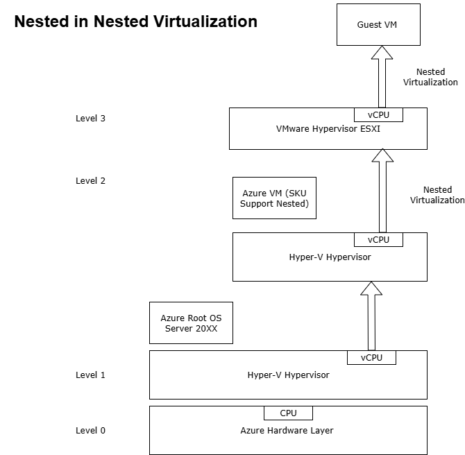

# ESXI-on-Azure-VM
- VMware ESXi in a nested virtualization setup on Azure.
- Run ESXi on Azure VM – Step-by-Step Guide to Nested Virtualization. 
- Deploy VMware ESXi in a nested Azure VM with this comprehensive guide. Learn how to configure virtualization, networking, and storage to build your own cloud lab.

# Scenario: Running ESXi or Hyper-V with Full Administrative Control on Azure

Imagine a scenario where you need full administrative control over a hypervisor like VMware ESXi or Microsoft Hyper-V. To achieve this level of control, you must deploy a nested virtualization environment—that is, running a hypervisor inside a virtual machine.
Since ESXi cannot be directly managed on Azure’s root Hyper-V layer, the solution is to install ESXi within a nested VM. I chose Microsoft Azure for this setup because it offers the flexibility and scalability needed to overcome local hardware limitations, making it ideal for lab environments, testing, or training scenarios. 

Lab Objective:
The primary goal of this lab is to facilitate the migration of on-premises virtual machines (VMware Machines) to Azure, by simulating a fully controlled hypervisor environment within the cloud.

# Architecture Diagram

The following diagram illustrates the nested ESXi deployment on Azure:

# 📦 [Deployment Guide](Deployment.md)
Main problem in this deployment is when running ESXI ISO not customised, you will get a message during installation :
"No compatible network adapter found. Please consult the product's Hardware Compatibility Guide (HCG) for list of supported adapters." 

For detailed deployment steps with screenshots, see Deployment.md

 Note: Be aware that issues may occur because running ESXi on a Hyper-V VM is not officially supported.

## [Resources](Resources.md)

- ESXi ISO
- Azure VM specs
- Network Configuration

  
# Conclusion
Setting up an environment to run the ESXi hypervisor within a Hyper-V virtual machine is a complex and unsupported configuration by most vendors. While it can be done for educational or testing purposes, it should never be used in production. Proceeding with such a setup is entirely at your own risk. What worked successfully in an on-premises environment did not translate well to an Azure VM. Nonetheless, testing and encountering issues is an essential part of the learning process. All suggestions and feedback are welcome.

# Thanks to
- Nakivo : https://www.nakivo.com/blog/install-esxi-hyper-v
- Alex Lopez : https://www.v-front.de/p/esxi-customizer-ps.html#download
