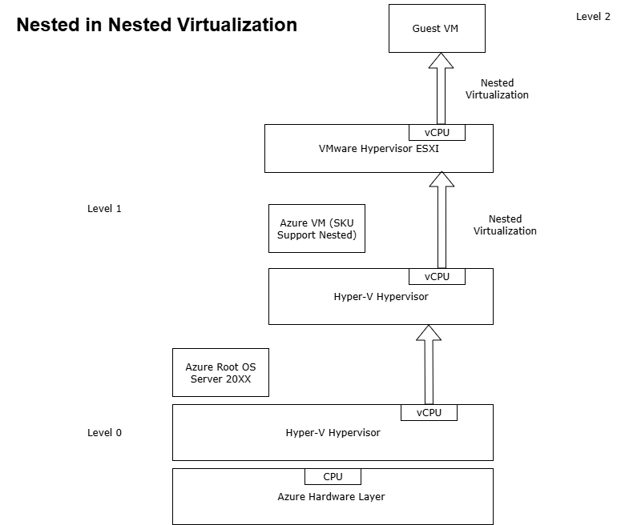

# ESXI-on-Azure-VM
VMware ESXi in a nested virtualization setup on Azure

# Scenario: Running ESXi or Hyper-V with Full Administrative Control on Azure

Imagine a scenario where you need full administrative control over a hypervisor like VMware ESXi or Microsoft Hyper-V. To achieve this level of control, you must deploy a nested virtualization environment—that is, running a hypervisor inside a virtual machine.
Since ESXi cannot be directly managed on Azure’s root Hyper-V layer, the solution is to install ESXi within a nested VM. I chose Microsoft Azure for this setup because it offers the flexibility and scalability needed to overcome local hardware limitations, making it ideal for lab environments, testing, or training scenarios. 

Lab Objective:
The primary goal of this lab is to facilitate the migration of on-premises virtual machines (VMware Machines) to Azure, by simulating a fully controlled hypervisor environment within the cloud.

# Architecture Diagram

The following diagram illustrates the nested ESXi deployment on Azure:

# 📦 Deployment Guide

For detailed deployment steps with
 screenshots, see Deployment.md

 Note: Be aware that issues may occur because running ESXi on a Hyper-V VM is not officially supported.

## Resources
- ESXi ISO
- Azure VM specs
- Networking setup
  
# Conclusion
Configuring an environment to run an ESXi hypervisor on a Hyper-V VM is a tricky process, and is not officially supported by vendors. However, you can deploy ESXi on a Hyper-V VM for educational and testing purposes. You can try to install ESXi hypervisor on a Hyper-V VM at your own responsibility. Do not use such solution in a production environment.

